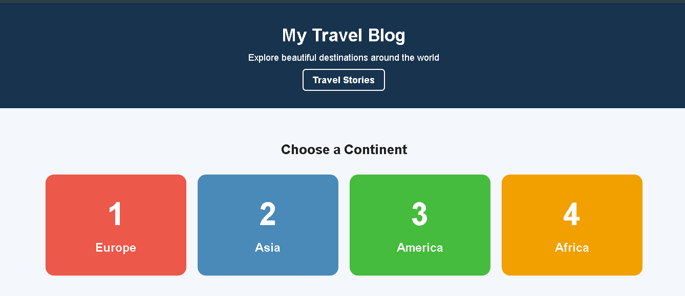
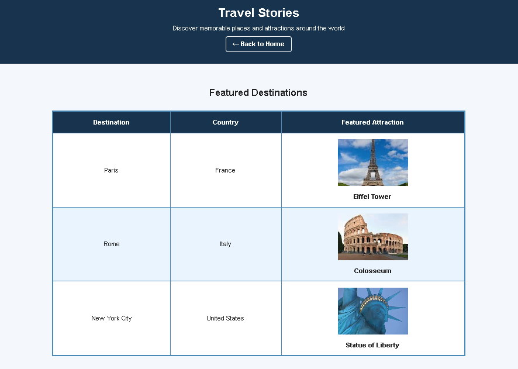

# Travel Blog — HTML & CSS

A responsive travel blog website developed as part of a **Web Development Fundamentals** assignment. The project demonstrates semantic HTML, CSS styling, internal navigation, nested destination lists, tables, clickable images, hover interactions, and responsive design.

## 🌍 Project Overview

The **Travel Blog** provides a simple and interactive way to explore destinations around the world. Visitors can navigate through continents, explore country and city lists, and discover featured attractions through the Travel Stories page.

The project consists of two main pages:

- **Homepage** — Features four numbered continent navigation blocks for Europe, Asia, America, and Africa, with nested country and city destination lists.
- **Travel Stories** — Features three destinations in a styled table with clickable attraction images that navigate to related travel information on the same page.

## ✨ Features

### 🗺️ Homepage

- Four numbered continent navigation blocks
- Distinct colors for each continent
- Interactive hover effects
- Internal anchor navigation to continent sections
- Nested country and city destination lists
- Visually differentiated continent sections
- Responsive layout for smaller screens
- Back-to-top navigation links

### 📖 Travel Stories

- Three featured destinations:
  - **Paris, France** — Eiffel Tower
  - **Rome, Italy** — Colosseum
  - **New York City, United States** — Statue of Liberty
- Clickable attraction images
- Internal links to related story sections
- Image opacity and scale hover effects
- Styled table with colorful borders
- Alternating table row colors
- Bold table headers
- Cell padding for readability
- Responsive table and image sizing
- Back-to-destinations navigation links

## 🛠️ Technologies

- **HTML5**
- **CSS3**
- Responsive Web Design
- Semantic HTML elements
- Internal HTML anchor navigation
- CSS transitions and hover effects
- SVG images
- CSS media queries

## 📁 Project Structure

```text
Travel_Blog_Project/
│
├── images/
│   ├── colosseum.svg
│   ├── eiffel-tower.svg
│   └── statue-of-liberty.svg
│
├── screenshots/
│   ├── homepage-top.png
│   └── travel_stories.png
│
├── homepage.html
├── travel_stories.html
├── README.md
└── Travel_Blog_Assignment_Report.docx
```

## 📸 Project Preview

### Homepage — Continent Navigation



### Travel Stories



## 🚀 How to Run

1. Clone or download the repository.
2. Open the project folder in **Visual Studio Code**.
3. Open `homepage.html`.
4. Run the website using a local development server such as **Live Server**, or open the HTML file directly in a web browser.
5. Use the navigation blocks and links to explore the destination lists and Travel Stories.

## 🎯 Learning Objectives

This project demonstrates practical application of:

- Semantic HTML structure
- Headings, lists, tables, links, and images
- CSS selectors and reusable classes
- Colors, borders, spacing, and typography
- CSS hover effects and transitions
- Internal page navigation using anchor links
- Responsive layouts using media queries
- Accessible image `alt` text
- Code comments explaining design intent
- Basic website organization and file management

## 📚 Academic Context

This project was developed for a university **Web Development Fundamentals** assignment focused on HTML and CSS.

The implementation demonstrates the required HTML structure, CSS styling, navigation, image interactions, nested lists, table formatting, and responsive presentation.

## 👤 Author

**Forgent Lab**

---

© 2026 Forgent Lab